# 第一章習題

**存放邏輯圖**

## 作業
* **第一週(09/12)作業 :** NOT、AND、OR、XOR、Mux、DMux
* **第二週(09/19)作業 :** NOT16、AND16、OR16、Mux16、OR8Way、Mux4Way16、Mux8Way16、DMux4Way、DMux8Way

## 邏輯圖

**Not**

**And**

**Or**

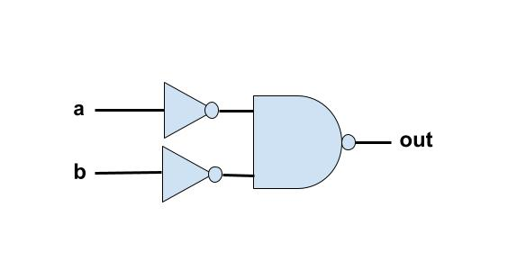

**Xor**

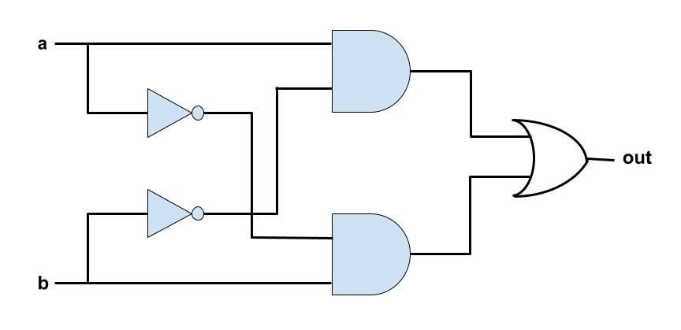

**Mux**

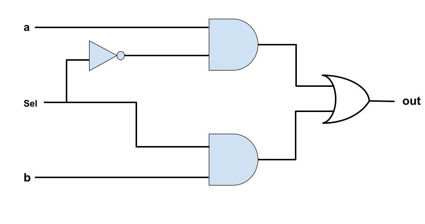

**DMux**

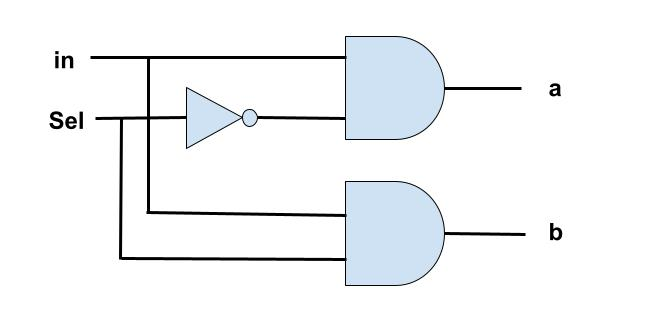

**Not16**

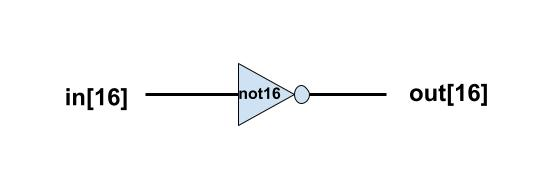

**And16**

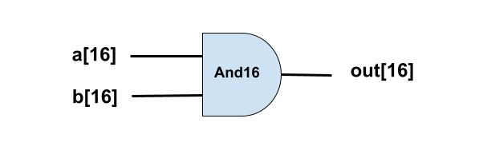

**Or16**

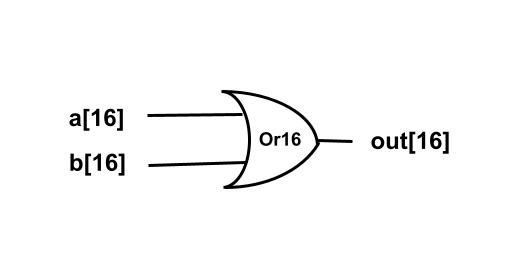

**Mux16**

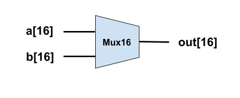

**Or8Way**

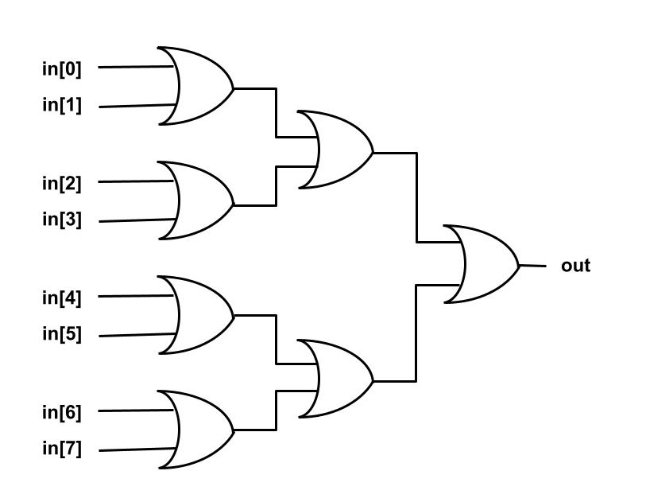

**Mux4Way16**

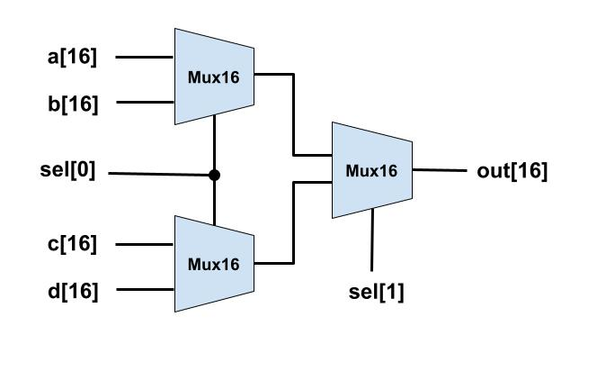

**Mux8Way16**

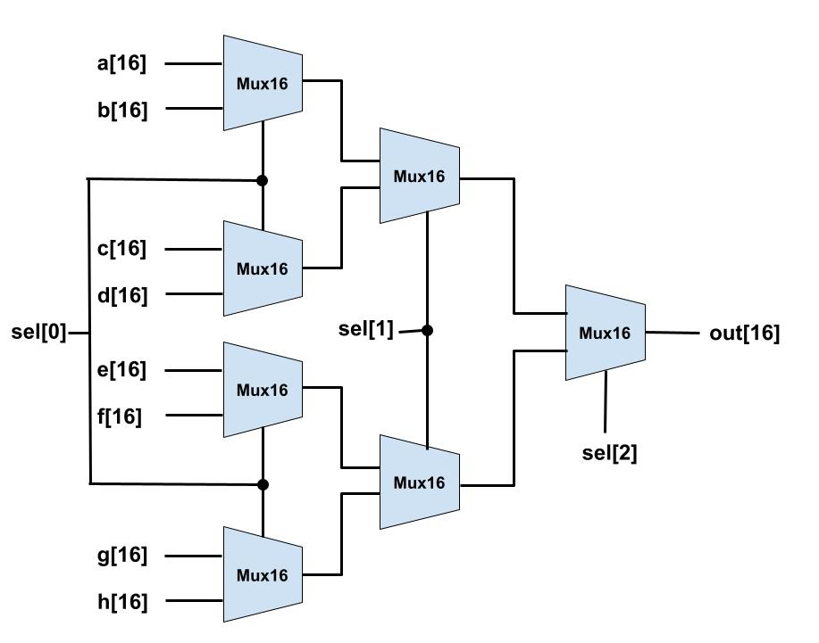

**DMux4Way**

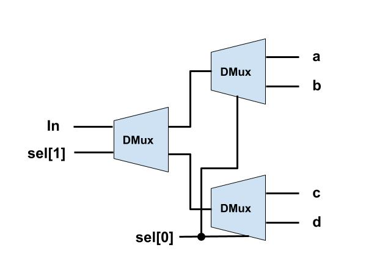

**DMux8Way**

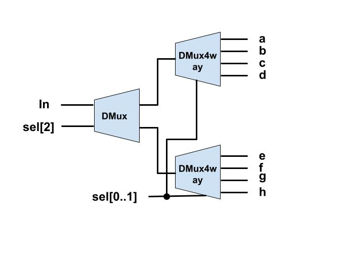

